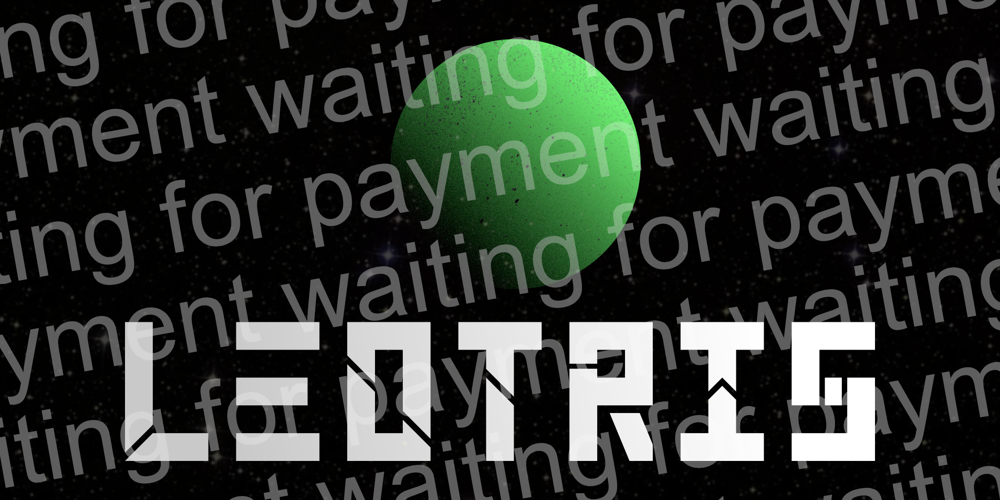
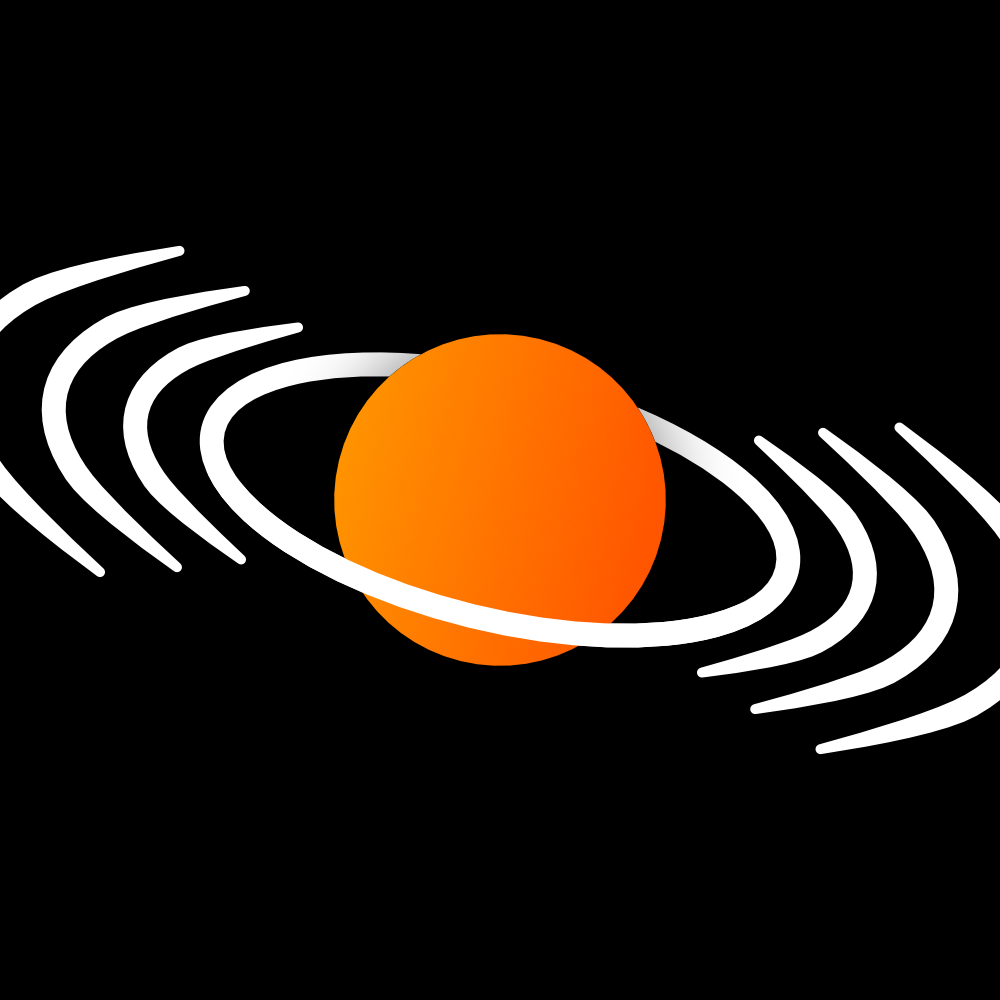

My portfolio
-----------------------

### code
- [New Taiko Charter](https://dlol.github.io/Taiko-Charter-New/)
- [dwm build](https://github.com/Dlol/dlol-dmenu) + [dmenu build](https://github.com/Dlol/dlol-dmenu) (though i use rofi now)
- [PDOME](https://github.com/Dlol/PDOME) purr data open source modular environment, totally something i work on

### logos

